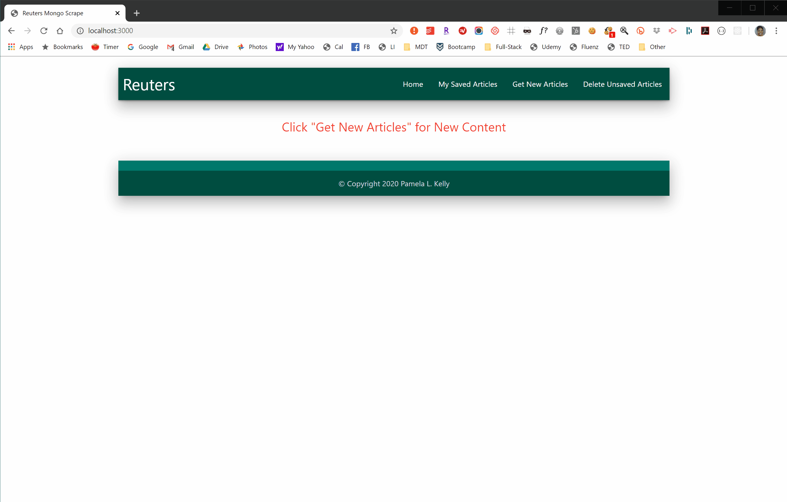

# All the News That's Fit to Scrape

## Overview
Web app that allows users to view and leave comments on the latest news scraped from Reuters World News using Mongoose and Cheerio. Scraped articles are stored in a MongoDB database.

### Technologies Used
  * Node JS v12.13.0
  * Express Node Package Manager (NPM) v4.17.1
  * Cheerio NPM
  * Axios NPM
  * MongoDB
  * Mongoose NPM
  * Handlebars NPM
  * Heroku
  * HTML
  * CSS
  * Materialize CSS
  * Material Icons

### Using the Scraper
  * Launch Scraper web application
  * The app scrapes the following data from Reuter World News at https://www.reuters.com/news/world:
     * Article Title
     * Article Summary
     * Article Link
     * Article Photo
  * Article data is stored in a MongoDB
  * Scraped articles are displayed on the application's home page
  * Users can save articles as well as post, update, and delete article notes, which are saved to MongoDB

## Completed Assignment

### Due
Sunday, April 12, 2020

### Student
Pam Kelly at [esq.kelly@gmail.com](mailto:esq.kelly@gmail.com)

Full-Stack Coding Bootcamp through UCB Extension

### Completed Assignment URLs
#### Github repository
[Github Link](https://github.com/PLKGIT/scraper) at https://github.com/PLKGIT/scraper
#### Deployed Application
[All the News](TBD) at TBD
#### All the News Fit to Scrape on Portfolios
[Professional Porfolio](https://www.pamkelly.com/portdev.html) at https://www.pamkelly.com/portdev.html

Copyright &copy; 2020 Pamela L. Kelly